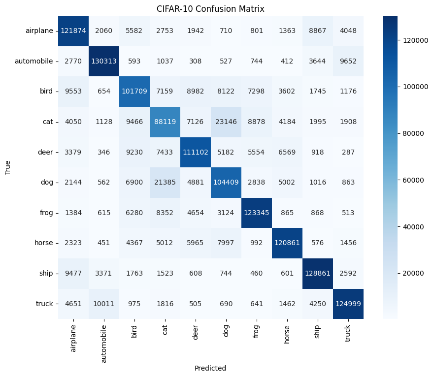

# CIFAR-10 Image Classifier

## 📌 프로젝트 소개
본 프로젝트는 **CIFAR-10 이미지 분류 문제**를 대상으로  
CNN(Convolutional Neural Network) 기반 모델을 구현하고,  
**학습 전략 및 구조적 개선을 통해 성능 향상을 실험**한 프로젝트입니다.

Baseline CNN 모델을 시작으로  
- Batch Normalization
- Optimizer 변경 (Adam → SGD)
- Learning Rate Scheduler

등을 단계적으로 적용하며 각 기법이 **모델 성능에 미치는 영향**을 비교·분석하였습니다.

---

## 🧾 사용한 기술
- **PyTorch**
- **CNN (Convolutional Neural Network)**
- **Data Augmentation**
  - RandomCrop
  - RandomHorizontalFlip
- **Batch Normalization**
- **Optimizer**
  - Adam
  - SGD (Momentum, Weight Decay)
- **Learning Rate Scheduler**
  - MultiStepLR

---

## 📊 실험 결과

| Model Configuration | Test Accuracy |
|---------------------|---------------|
| Baseline CNN (Adam) | 79.75%        |
| + Batch Normalization | 81.77%      |
| + SGD + LR Scheduler | **84.49%**   |

> Batch Normalization과 Learning Rate Scheduler를 적용함으로써  
> 모델의 일반화 성능이 점진적으로 향상됨을 확인하였습니다.

---

## 📌 실험 정리 및 한계
본 프로젝트의 목적은 **CNN 기본 구조와 학습 전략에 대한 이해**에 있으며,  
사전 학습된 모델(ResNet 등)을 활용한 성능 극대화보다는  
각 기법의 효과를 직접 실험하고 비교하는 데 중점을 두었습니다.

향후 확장 가능성으로는 다음을 고려할 수 있습니다.
- Pretrained CNN 모델 기반 fine-tuning
- Advanced augmentation 기법 (Mixup, CutMix)
- Confusion Matrix 및 학습 곡선 시각화 추가

---

## 📌 결과 시각화

