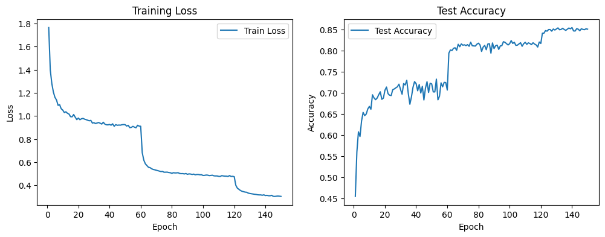

# CIFAR-10 Image Classifier

## 📌 프로젝트 소개
본 프로젝트는 **CIFAR-10 이미지 분류 문제**를 대상으로  
CNN(Convolutional Neural Network) 기반 모델을 구현하고,  
**학습 전략 및 구조적 개선을 통해 성능 향상을 실험**한 프로젝트입니다.

Baseline CNN 모델을 시작으로 학습 전략을 단계적으로 개선하고,  
최종적으로 **ResNet 논문을 재현**하여 성능을 극대화하였습니다.

---

## 📁 구조

```
cifar10-pytorch/
├── cnn/
│   ├── notebooks/
│   │   ├── cifar10_basic.ipynb        # Baseline CNN
│   │   ├── batch_normalization.ipynb  # + Batch Normalization
│   │   └── scheduler.ipynb            # + SGD + LR Scheduler
│   └── images/
│       ├── confusion_matrix.png
│       └── loss_accuracy_curve.png
└── resnet/
    ├── README.md                      # ResNet 논문 정리
    ├── CIFAR_RESNET.ipynb             # ResNet18 구현
    └── img/                           # 논문 figure 이미지
```


---

## 🧾 사용한 기술
- **PyTorch**
- **CNN (Convolutional Neural Network)**
- **Data Augmentation**
  - RandomCrop
  - RandomHorizontalFlip
- **Batch Normalization**
- **Optimizer**
  - Adam
  - SGD (Momentum, Weight Decay)
- **Learning Rate Scheduler**
  - MultiStepLR

---

## 📊 실험 결과

| Model Configuration | Test Accuracy |
|---------------------|---------------|
| Baseline CNN (Adam) | 79.75%        |
| + Batch Normalization | 81.77%      |
| + SGD + LR Scheduler | **84.49%**   |
| **ResNet18** | **논문 재현** | **95.35%** |


---

## 🧠 CNN 실험 (`cnn/`)

Baseline CNN 모델을 시작으로 아래 기법들을 단계적으로 적용하며  
각 기법이 **모델 성능에 미치는 영향**을 비교·분석하였습니다.

- **Batch Normalization**: Internal Covariate Shift 감소로 학습 안정화
- **SGD + Momentum + Weight Decay**: Adam 대비 일반화 성능 향상
- **MultiStepLR Scheduler**: 초반엔 크게, 후반엔 세밀하게 학습

---

## 📌 결과 시각화




---


## 🏗️ ResNet 논문 재현 (`resnet/`)

> 논문: [Deep Residual Learning for Image Recognition](https://arxiv.org/abs/1512.03385)  
> 논문 정리: [resnet/README.md](./resnet/README.md)

CIFAR-10(32×32)에 맞게 원본 ResNet18 구조를 아래와 같이 수정하였습니다.

| 레이어 | 원본 (ImageNet) | 수정 (CIFAR-10) |
|--------|----------------|----------------|
| conv1 kernel | 7×7, stride=2 | 3×3, stride=1 |
| maxpool | MaxPool2d | Identity (제거) |
| fc | 1000 classes | 10 classes |