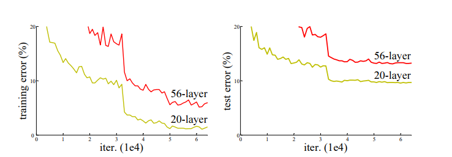
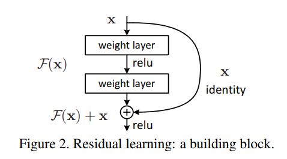
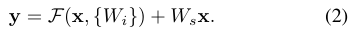
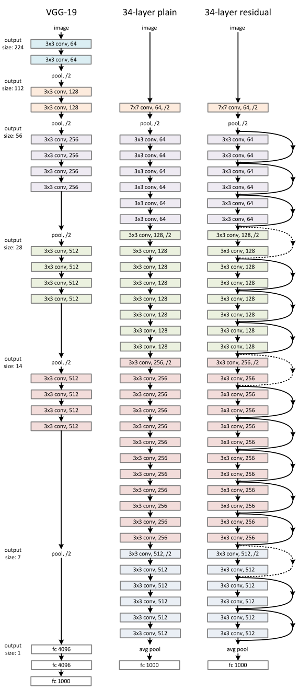
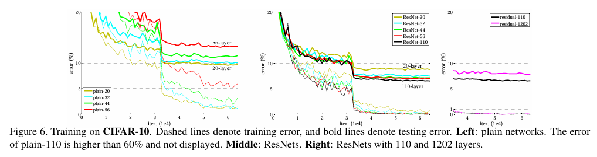

# ResNet 논문 재현 및 구조 분석 (CIFAR-10)
### Deep Residual Learning for Image Recognition
논문 링크 : https://arxiv.org/abs/1512.03385
## Abstract
 

모델의 깊이가 증가할수록 학습을 하는 것이 어려워진다.   
ResNet 논문은 이를 해결하기 위해 **Residual Learning**을 소개한다.   
VGG net 보다 8배 깊은 **152 layer**를 쌓았고, VGG보다 복잡도는 낮았다.   
ImagetNet 데이터셋으로 3.57% error rate을 달성하며 **ILSVRC Classification Task에서 1등**을 달성하였다.

## Introduction

Features 의 level 은 Stack layer(깊이)로 풍부해진다.     

그렇다면 ***Layer를 깊게 쌓을수록 학습이 쉬워질까?***

학습 과정에서 생기는 문제는 아래와 같다.
### 1. Convergence Problem
 - Vanishing / Exploding gradients으로 발생하여 학습 초기부터 Convergence를 방해한다.
 - Normalized initialization, Intermediate normalization layers 등으로 해결할 수 있게 되었다.
   
    
   
### 2. Degradation Problem
- 깊이가 증가할수록 Accuracy가 포화되고, 그 이후로 빠르게 하락하였다.

- Layer를 추가할수록 Training Error도 높아진다.

깊은 모델을 만들 때 얕은 모델의 layer를 복사하고 나머지 추가 레이어들은 단순히 identity mapping만 했음에도 여전히 깊은 모델에서 training error가 높게 나왔다.

이를 해결하고자  **Deep residual learning framework** 를 사용한다.

 

### Residual learning

Underlying Mapping을 H(x)라 한다면 여기에 Input인 x를 더해준다.    
즉, **H(x)=F(x)+x**가 되는 것이다. 이는 계산이나 parameter 수를 늘리지 않는다.   
이를 한 개 이상의 layer를 스킵하기 때문에 **Shorcut-connection**이라 부른다.  
  

ImageNet에 대한 실험을 통해 다음과 같은 결과를 냈다.
1. Deep Residual Networks는 Optimize가 쉽다. 
2. 깊이가 크게 증가하더라도 정확도 향상을 달성한다.

## 2. Deep Residual Learning
## 2.1. Residual Learning

F(x) = H(x) - x를 모델 입장에서 H(x) = F(x) + x라 생각해보면 학습이 더 쉬워진다.

만약 Identify mapping이 최적이라면, 여러 비선형 레이어의 가중치를 0으로 수렴시키고 Identity mapping이 되도록 만들 것이다.

## 2.2. Identity Mapping by Shortcuts

Building Block의 정의는 다음과 같다.

x와 y는 각각 입력 및 출력 벡터이고 함수 F는 학습될 Residual mapping이다.   

F + x는 shortcut-connection과  element-wise addition을 통해 수행된다.   
이는 parameter과 계산 복잡성을 증가시키지 않는다.

 

만일 x와 F의 차원이 다르다면 위의 수식을 사용할 수 있다.   
차원을 맞춰주기 위해  linear projection Ws를 사용한다.

## 2.3. Network Architectures

Plain Network와 Residual Network를 비교해보았다.

### Plain Network

VGG에서 영감을 받은 모델로, 대부분 3x3의 필터로 이루어져있다.  
Conv(Stride=2)으로 이미지 크기를 줄이고 Channer size는 두 배로 늘린다.

### Residual Network
Plain Network에 Shortcut connection을 삽입한다.  

입력과 출력의 차원이 동일할 경우에는 **Identity Shortcut**(수식 (1))을 사용하며,  
차원이 다를 경우에는 두가지 방법을 사용한다.   
1. 남은 차원을 0으로 채우는 Zero Padding 후 Identity Shortcut을 적용한다.
2. **Projection Shortcut**(수식(2))을 통해 차원을 맞춘다.

## 2.4. Implementation

## 3. Experiments
## 3.1. ImageNet Classification
### Plain NetWorks
18개 Layer로 이루어진 모델과 34개 Layer로 이루어진 모델을 사용하였다.   

34-layer 모델이 trainging 과정 전체에서 18-layer모델보다 높은 training error를 기록한 것을 볼 수 있다.

### Residual NetWorks
첫번째 비교로는 모든 shortcut에 identity mapping을 하고 늘어난 차원에는 zero padding을 적용하였다.   
따라서 추가적인 매개변수는 없었다.

결과를 보면 깊은 layer에서 성능도 훨씬 좋아지고 training error도 더 낮다는 것을 알 수 있다.

### Identity vs. Projection Shortcut

ResNet에 대한 세가지 옵션을 비교하였다.

A. 증가한 차원에 대해 zero padding 적용 후 모든 shortcut은 parameter free   
B. 증가한 차원은 Projection shortcut, 나머지는 Identity shortcut   
C. 전부 Projection shortcut

성능은 C-B-A 순으로 좋았다. 하지만 차이는 미세하기에 이 논문에서는 메모리/시간 복잡도와 모델 사이즈를 줄이기 위해 옵션 B를 사용했다.   
Identity shortcut이 **Bottleneck** 구조에 중요하기 때문이다.

### Deeper Bottleneck Architectures

깊은 ResNet에서는 학습시간을 줄이기 위해 Bottlenect 구조를 사용한다.   
1x1, 3x3 그리고 1x1 convolutions 이 세가지 스택을 사용한다.
1x1 layers는 차원을 줄이고 키우는 역할을 하는데 그 결과 3×3 레이어는 더 작은 입력/출력 차원을 가지는 bottleneck 구조가 된다.

만약 identity shortcut이 projection shortcut으로 대체된다면 shortcut이 두개의 고차원 끝단을 연결하기 때문에 시간 복잡도와 모델 사이즈는 두배가 된다는 걸 볼 수 있다.
그렇기에 Identity shortcut은 bottlenect 구조에 더 효과적이다.

## 3.2. CIFAR-10 and Analysis

결과를 보면 ImageNet과 마찬가지로 layer가 증가할 수록 성능이 좋아지는 걸 볼 수 있으나 오른쪽 그래프에서 1202 layer로 늘렸을 때 overfitting이 발생하는 걸 볼 수 있다.

CIFAR-10 데이터셋은 이미지 사이지가 32x32로 ImageNet 보다 훨씬 작아서 모델 구조를 수정해서 사용한다.

# 모델 구현
Test Acc: 95.35% 